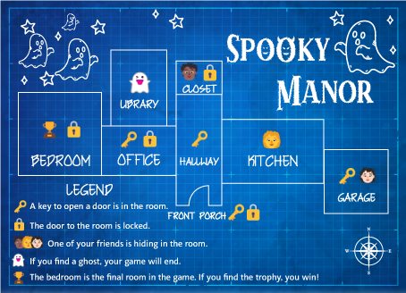

# lesson1_spooky_manor
Spooky Manor Lesson 1 for Houston Advanced Coders

# Reference material

[Intro to Python](https://vscode.dev/edu?courseId=intro-to-python&workspace-scheme=vscode-edu-workspace&profile=default)

[Homework](https://vscodeedu.com/courses/event-2023-hoc) - Work through the Spooky Manor Tutorial

[Homework 2.0](my-spookymanor.ph) Build your own text based adventure game

[Finished Tutorial](sample.py)
